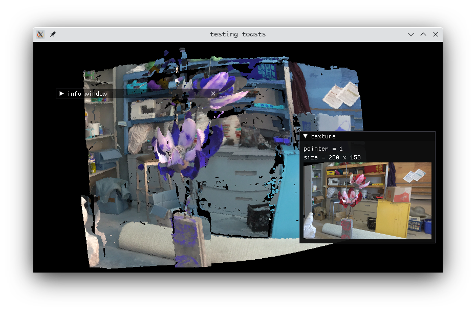

# Photogrammetry Application 
simple photogrammetry software that uses uncalibrates stereo images to form a point cloud. the procedure to converting to point cloud is written in python/opencv. the render in written in opengl/imgui/c++.  

## results 

> converted from uncalibrated images case. 

> sample dataset taken from https://www.semantic3d.net
